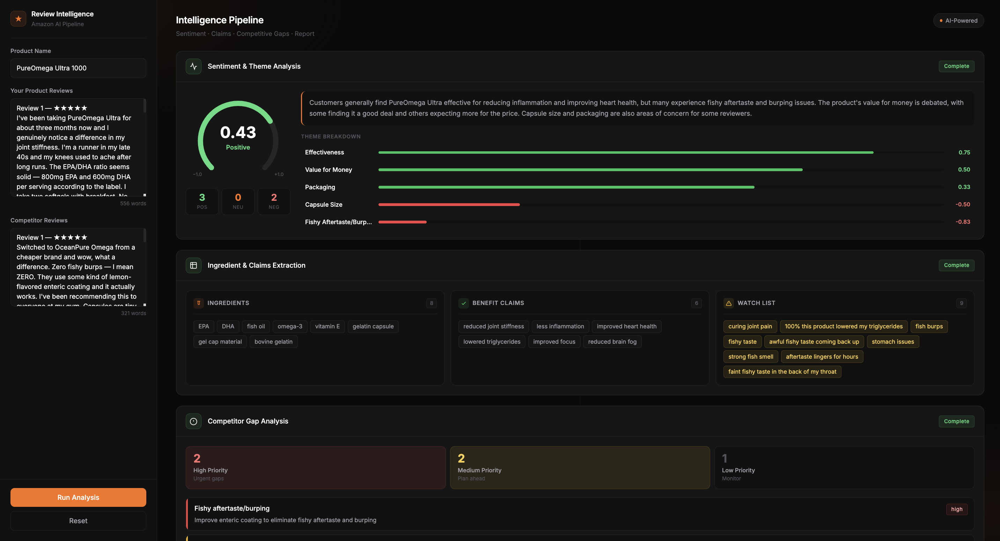

# ReviewIntel AI

<p align="center">
  
</p>

<p align="center">
  <strong>AI-Powered Voice of Customer Intelligence Platform</strong>
</p>

<p align="center">
  Transform customer reviews into actionable business intelligence through sentiment analysis, competitor benchmarking, compliance monitoring, and executive reporting.
</p>

<p align="center">
  
  
  
  
  
</p>

---

## Overview

ReviewIntel AI is an AI-powered customer intelligence platform that transforms unstructured product reviews into strategic business insights.

The platform analyzes customer feedback using a multi-stage AI pipeline to uncover:

* Customer sentiment and emotions
* Recurring pain points
* Product strengths and weaknesses
* Ingredient insights
* Compliance and regulatory risks
* Competitive advantages
* Market gaps and opportunities

Instead of manually reading hundreds of reviews, teams receive executive-ready intelligence reports in minutes.

### Built For

* Product Managers
* Marketing Teams
* Brand Strategists
* E-Commerce Managers
* Customer Experience Teams
* Research & Development Teams
* Market Research Analysts

---

# Demo

## Dashboard


---

## Live Analysis Progress


---

## Executive Intelligence Report


---

## Competitor Gap Analysis


---

# Key Features

## Multi-Stage AI Pipeline

ReviewIntel AI performs a specialized four-stage analysis workflow:

### Stage 1 — Sentiment & Theme Analysis

Extracts:

* Overall sentiment
* Customer satisfaction indicators
* Positive and negative themes
* Recurring feedback patterns

### Stage 2 — Ingredient & Claims Intelligence

Identifies:

* Frequently mentioned ingredients
* Customer-reported benefits
* Side effects and concerns
* Product claims and messaging trends

### Stage 3 — Competitor Gap Analysis

Discovers:

* Market opportunities
* Unmet customer needs
* Competitive weaknesses
* Product differentiation opportunities

### Stage 4 — Executive Report Generation

Generates:

* Strategic recommendations
* Product improvement opportunities
* Marketing insights
* Executive-ready business reports

---

## Provider-Agnostic AI Architecture

Switch AI providers without changing business logic.

Supported providers:

| Provider         | Status |
| ---------------- | ------ |
| Groq             | ✅      |
| Google Gemini    | ✅      |
| Anthropic Claude | ✅      |

The provider abstraction layer allows easy experimentation and deployment across multiple LLM ecosystems.

---

## Real-Time Analysis Streaming

Uses Server-Sent Events (SSE) to provide live updates during analysis.

Users can monitor:

* Current analysis stage
* Progress status
* Intermediate outputs
* Report generation progress
* Final intelligence report completion

---

## Compliance Risk Detection

Automatically flags:

* Medical claims
* Regulatory concerns
* Potential compliance violations
* High-risk customer messaging
* Marketing claims requiring review

---

## Competitive Intelligence Engine

Analyze customer feedback against competitors to uncover:

* Market gaps
* Customer frustrations
* Product opportunities
* Messaging advantages
* Positioning opportunities

---

# Architecture

```text
                     ┌──────────────────┐
                     │ Product Reviews  │
                     └─────────┬────────┘
                               │
                               ▼

          ┌───────────────────────────────────┐
          │ Sentiment & Theme Analysis Engine │
          └───────────────┬───────────────────┘
                          │
                          ▼

        ┌─────────────────────────────────────┐
        │ Ingredient & Claims Intelligence    │
        └───────────────┬─────────────────────┘
                        │
                        ▼

         ┌───────────────────────────────────┐
         │ Competitor Gap Analysis Engine    │
         └───────────────┬───────────────────┘
                         │
                         ▼

         ┌───────────────────────────────────┐
         │ Executive Intelligence Generator  │
         └───────────────┬───────────────────┘
                         │
                         ▼

                Strategic Business Report
```

---

# Technology Stack

## Backend

* FastAPI
* Python 3.11+
* Uvicorn

## AI Layer

* Groq
* Google Gemini
* Anthropic Claude

## Frontend

* HTML5
* JavaScript
* Server-Sent Events (SSE)

## Infrastructure

* Docker Ready
* Railway Deployment Ready

---

# Installation

## Clone Repository

```bash
git clone https://github.com/yourusername/reviewintel-ai.git

cd reviewintel-ai
```

---

## Create Virtual Environment

```bash
python -m venv venv
```

### Windows

```bash
venv\Scripts\activate
```

### macOS/Linux

```bash
source venv/bin/activate
```

---

## Install Dependencies

```bash
pip install -r requirements.txt
```

---

## Configure Environment Variables

```bash
cp .env.example .env
```

Choose your preferred AI provider.

### Groq Configuration

```env
AI_PROVIDER=groq

GROQ_API_KEY=your_api_key

GROQ_MODEL=llama-3.3-70b-versatile
```

---

### Gemini Configuration

```env
AI_PROVIDER=gemini

GEMINI_API_KEY=your_api_key

GEMINI_MODEL=gemini-2.0-flash-lite
```

---

### Claude Configuration

```env
AI_PROVIDER=claude

ANTHROPIC_API_KEY=your_api_key

CLAUDE_MODEL=claude-sonnet-4-6
```

---

# Running Locally

Start the FastAPI server:

```bash
uvicorn main:app --reload
```

Open:

```text
http://127.0.0.1:8000
```

---

# Analysis Workflow

Every report follows the same deterministic pipeline.

| Step | Analysis                         |
| ---- | -------------------------------- |
| 1    | Sentiment & Theme Analysis       |
| 2    | Ingredient & Claims Intelligence |
| 3    | Competitor Gap Analysis          |
| 4    | Executive Report Generation      |

This architecture ensures consistent report quality and reproducible outputs.

---

# Example Business Questions Answered

## Customer Experience

* What do customers love most?
* What complaints occur repeatedly?
* Which themes drive positive sentiment?
* Which themes drive dissatisfaction?

## Product Development

* What improvements should be prioritized?
* Which side effects are most discussed?
* What ingredients receive praise?
* What features should be redesigned?

## Marketing Strategy

* Which benefits resonate most with customers?
* Which messaging drives engagement?
* What claims should be avoided?
* What language appears most persuasive?

## Competitive Strategy

* What are competitors doing better?
* Which customer needs remain unmet?
* What market opportunities exist?
* Where can we differentiate?

---

# Example Intelligence Output

```markdown
Theme: Energy Enhancement

Sentiment Score: 8.7 / 10

Positive Signals:
- Improved daily energy
- Enhanced workout performance
- Better focus and productivity

Negative Signals:
- Jitters reported by some customers
- Afternoon energy crash
- Taste concerns

Opportunity:

Develop a sustained-release formulation
targeting customers seeking longer-lasting
energy support without crashes.
```

---

# Estimated Cost Per Analysis

| Provider          | Approximate Cost |
| ----------------- | ---------------- |
| Groq 8B           | Free             |
| Groq 70B          | Free / ~$0.01    |
| Gemini Flash Lite | Free Tier        |
| Claude Sonnet     | ~$0.05–0.15      |

Actual costs vary based on review length and model selection.

---

# Deployment

## Railway Deployment

1. Push repository to GitHub
2. Create a Railway project
3. Connect the repository
4. Configure environment variables
5. Deploy

Start command:

```bash
uvicorn main:app --host 0.0.0.0 --port $PORT
```

---

# Project Structure

```text
reviewintel-ai/
│
├── main.py
├── requirements.txt
├── .env.example
│
├── services/
│   ├── sentiment.py
│   ├── claims.py
│   ├── gap_analysis.py
│   └── report_generator.py
│
├── templates/
│
├── static/
│
├── docs/
│   ├── screenshots/
│   └── images/
│
└── README.md
```

---

# Roadmap

## Planned Features

* PDF report export
* Multi-product comparison
* Trend analysis over time
* Amazon URL review ingestion
* Historical report search
* Vector database integration
* Dashboard analytics
* User authentication
* Report sharing
* Team collaboration features

---

# Why This Project Matters

Customer reviews contain some of the most valuable signals about products, customer needs, and market opportunities.

ReviewIntel AI transforms thousands of words of unstructured feedback into actionable intelligence that enables businesses to:

* Improve products faster
* Reduce customer complaints
* Identify competitive advantages
* Discover market opportunities
* Make data-driven decisions

---

# License

MIT License

---

# Author

Built to demonstrate how modern AI systems can transform raw customer feedback into strategic business intelligence through multi-stage analysis pipelines, real-time processing, and executive reporting.
# ReviewIntel-AI
